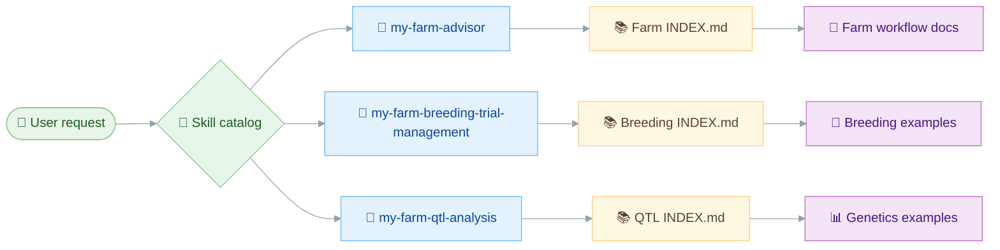
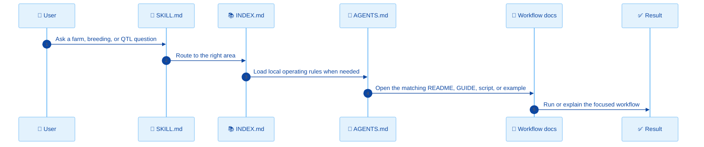
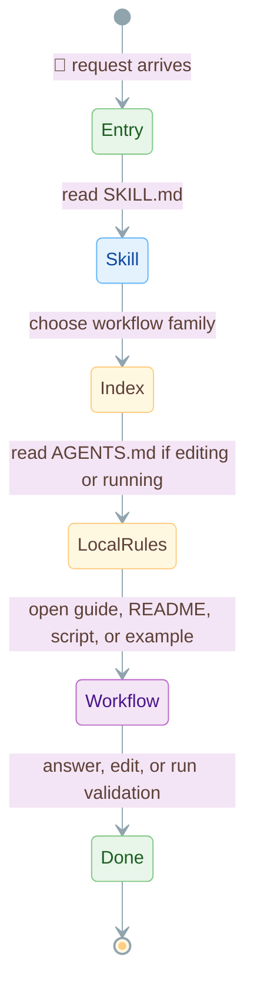
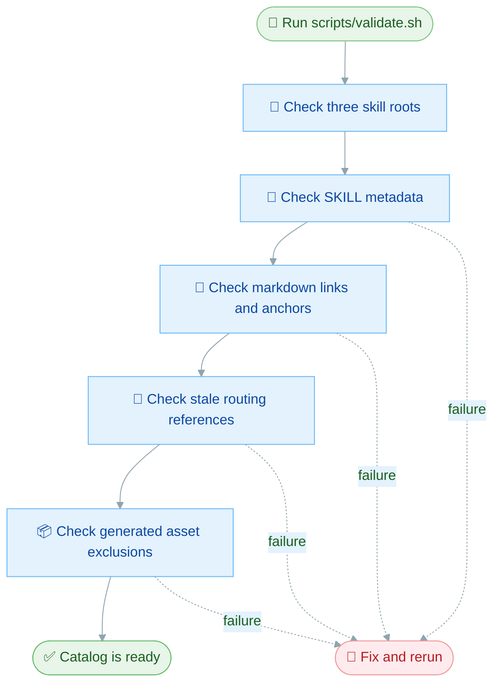

# My Farm Advisor Skills

This repository is the My Farm Advisor skill catalog. It contains three in-repo skills and the local instructions, examples, scripts, and validation checks that make those skills discoverable by agents and readable by humans.

The catalog is intentionally focused:

- `my-farm-advisor` for farm advisory, field data, weather, soil, imagery, reporting, and strategy workflows.
- `my-farm-breeding-trial-management` for breeding operations, trial design, fieldbooks, germplasm, selection, crossing, and placement workflows.
- `my-farm-qtl-analysis` for QTL, GWAS, eQTL, quality control, population structure, genomic prediction, and reporting workflows.

## Skill Catalog

| Skill | Start here | What it does | Best for |
| --- | --- | --- | --- |
| 🌾 `my-farm-advisor` | [`my-farm-advisor/SKILL.md`](my-farm-advisor/SKILL.md) | Routes farm advisory work into field, soil, weather, imagery, EDA, strategy, admin, and data-pipeline workflows | Farm data rebuilds, field reports, geospatial context, agronomic analysis |
| 🌱 `my-farm-breeding-trial-management` | [`my-farm-breeding-trial-management/SKILL.md`](my-farm-breeding-trial-management/SKILL.md) | Routes breeding operations into design, fieldbook, germplasm, selection, crossing, and field-trial placement examples | Breeding program execution and operational planning |
| 🧬 `my-farm-qtl-analysis` | [`my-farm-qtl-analysis/SKILL.md`](my-farm-qtl-analysis/SKILL.md) | Routes quantitative genetics work into mapping, QC, structure, prediction, and reporting examples | GWAS, eQTL, classical QTL, genomic prediction, and genetics reporting |

## How The Catalog Routes Work

Each top-level skill keeps `SKILL.md` compact. Agents read it first, then open `INDEX.md` to find the right workflow area, then use the local `AGENTS.md`, `README.md`, guide, script, or example for the actual work.



## The Three Skills

### 🌾 My Farm Advisor

`my-farm-advisor` is the farm operations and advisory skill. It is the right entrypoint when the request is about farm data, field boundaries, soil, weather, satellite imagery, EDA, reports, maps, maturity planning, or strategy.

| Area | Index | Examples of work |
| --- | --- | --- |
| Admin | [`admin/INDEX.md`](my-farm-advisor/admin/INDEX.md) | Geoadmin workflows and interactive maps |
| Data sources | [`data-sources/INDEX.md`](my-farm-advisor/data-sources/INDEX.md) | Data rebuilds, deterministic pipeline runs, farm intelligence reporting |
| EDA | [`eda/INDEX.md`](my-farm-advisor/eda/INDEX.md) | Exploration, comparisons, correlations, visualization, time series, field-level boundary/CDL/weather analysis |
| Field management | [`field-management/INDEX.md`](my-farm-advisor/field-management/INDEX.md) | Boundaries, CSB sampling, headlands |
| Imagery | [`imagery/INDEX.md`](my-farm-advisor/imagery/INDEX.md) | Landsat and Sentinel-2 workflows |
| Soil | [`soil/INDEX.md`](my-farm-advisor/soil/INDEX.md) | SSURGO, CDL, poster-card outputs |
| Strategy | [`strategy/INDEX.md`](my-farm-advisor/strategy/INDEX.md) | Crop strategy and maturity planning |
| Weather | [`weather/INDEX.md`](my-farm-advisor/weather/INDEX.md) | NASA POWER weather and derived farm weather analysis |

### 🌱 My Farm Breeding Trial Management

`my-farm-breeding-trial-management` is the breeding operations skill. Use it when the work is about running a breeding program rather than analyzing genetics after the fact.

| Area | Start here | Examples of work |
| --- | --- | --- |
| Design | [`INDEX.md`](my-farm-breeding-trial-management/INDEX.md) | RCBD, alpha-lattice, augmented designs |
| Fieldbook | [`INDEX.md`](my-farm-breeding-trial-management/INDEX.md) | Plot sheets, labels, imports, field sync |
| Field trial placement | [`INDEX.md`](my-farm-breeding-trial-management/INDEX.md) | Field-boundary-aware trial placement |
| Germplasm | [`INDEX.md`](my-farm-breeding-trial-management/INDEX.md) | Accession, pedigree, mock breeding-system integrations |
| Selection | [`INDEX.md`](my-farm-breeding-trial-management/INDEX.md) | Selection indexes, ranking, cycle simulation |
| Crossing | [`INDEX.md`](my-farm-breeding-trial-management/INDEX.md) | Mate pairing and crossing plans |

### 🧬 My Farm QTL Analysis

`my-farm-qtl-analysis` is the quantitative genetics skill. Use it when the request is about genotype, phenotype, expression, marker-trait analysis, prediction, or reporting.

| Area | Start here | Examples of work |
| --- | --- | --- |
| Mapping | [`INDEX.md`](my-farm-qtl-analysis/INDEX.md) | GWAS, eQTL, classical QTL, GxE, covariates, rare variants |
| QC | [`INDEX.md`](my-farm-qtl-analysis/INDEX.md) | VCF validation, SNP filtering, sample QC, imputation |
| Structure | [`INDEX.md`](my-farm-qtl-analysis/INDEX.md) | PCA, admixture, LD decay, haplotypes, kinship |
| Prediction | [`INDEX.md`](my-farm-qtl-analysis/INDEX.md) | Genomic prediction, BLUP, Bayesian GP, elastic net, cross-validation |
| Reporting | [`INDEX.md`](my-farm-qtl-analysis/INDEX.md) | Ideograms, analysis reports, real-dataset packaging |

## Agent Discovery Flow

This is how an agent should move through the repo. The top-level router stays small; the detailed instructions live close to the workflow they control.



## Skill File Pattern

Each top-level skill follows the same structure so discovery stays predictable.

| File | Required | Purpose |
| --- | --- | --- |
| `SKILL.md` | ✅ | Compact routing entrypoint with stable frontmatter name |
| `INDEX.md` | ✅ | Human and agent navigation map for workflow families |
| `README.md` | ✅ | Human overview of the skill and major capabilities |
| `AGENTS.md` | ✅ | Local operating instructions for agents working in that skill tree |
| `PROVENANCE.md` | ✅ | Source and maintenance record for the skill tree |



## Runtime And Output Rules

The catalog contains instructions, scripts, examples, metadata, and small reproducibility records. Generated data and runtime outputs stay out of the repository.

| Rule | Why |
| --- | --- |
| Keep generated outputs out of Git | Prevents runtime data, maps, reports, and downloaded payloads from bloating the catalog |
| Use `${DATA_PIPELINE_DATA_ROOT}` for farm pipeline runs | Keeps farm data under an explicit external runtime root |
| Commit metadata and source records | Keeps workflows reproducible without committing generated payloads |
| Run validation after structural changes | Catches missing routers, stale links, and asset-policy regressions |

## Validation

Run validation from the repository root:

```bash
./scripts/validate.sh
```

The validator checks:

- Top-level skill directories are present.
- Required `SKILL.md`, `README.md`, `INDEX.md`, and `PROVENANCE.md` files exist.
- `SKILL.md` frontmatter starts at the top of the file and uses the directory name as the discovery key.
- Markdown relative links and local heading anchors resolve.
- Stale routing references are absent.
- Generated data paths and forbidden assets are not tracked.
- Geoadmin metadata records contain required reproducibility fields.



## Repository Layout

```text
my-farm-advisor-skills/
├── README.md
├── AGENTS.md
├── scripts/
│   └── validate.sh
├── my-farm-advisor/
│   ├── SKILL.md
│   ├── INDEX.md
│   ├── README.md
│   ├── AGENTS.md
│   └── ...
├── my-farm-breeding-trial-management/
│   ├── SKILL.md
│   ├── INDEX.md
│   ├── README.md
│   ├── AGENTS.md
│   └── ...
└── my-farm-qtl-analysis/
    ├── SKILL.md
    ├── INDEX.md
    ├── README.md
    ├── AGENTS.md
    └── ...
```

## Working In This Repo

| Task | Start here | Validate with |
| --- | --- | --- |
| Route a farm advisory request | [`my-farm-advisor/SKILL.md`](my-farm-advisor/SKILL.md) | `./scripts/validate.sh` |
| Update a farm workflow doc | Matching `my-farm-advisor/**/AGENTS.md` | `./scripts/validate.sh` plus local command if documented |
| Route a breeding request | [`my-farm-breeding-trial-management/SKILL.md`](my-farm-breeding-trial-management/SKILL.md) | `./scripts/validate.sh` |
| Route a QTL request | [`my-farm-qtl-analysis/SKILL.md`](my-farm-qtl-analysis/SKILL.md) | `./scripts/validate.sh` |
| Change catalog structure | Root [`AGENTS.md`](AGENTS.md) and `scripts/validate.sh` | `bash -n scripts/validate.sh && ./scripts/validate.sh` |

Keep edits focused, keep generated outputs out of Git, and route through the nearest `INDEX.md` before opening detailed workflow docs.
