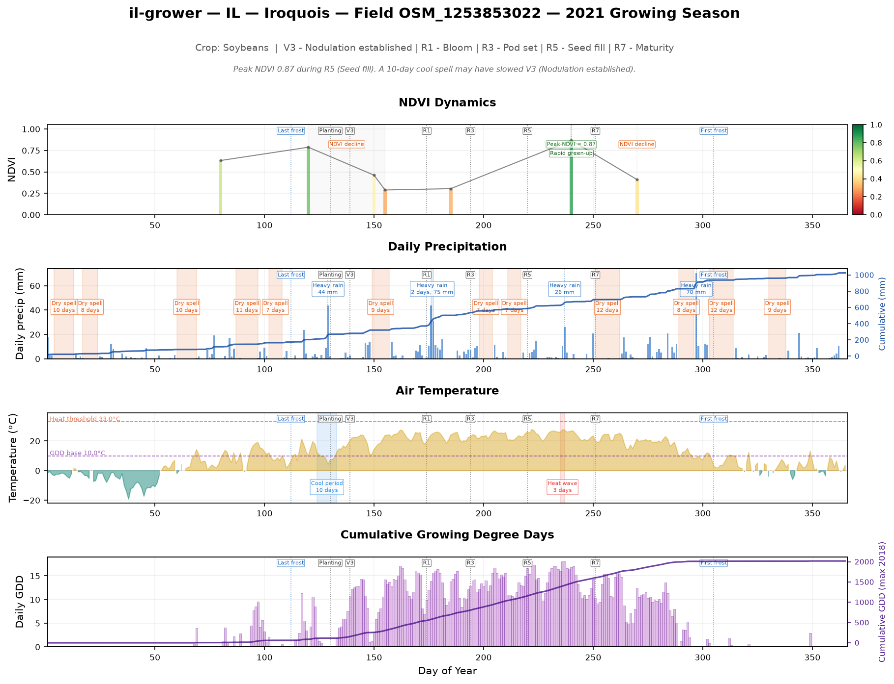

# Field-Year Dashboard — Example

## Workflow

Generates a 4-panel dashboard for a single field and growing season:

1. **NDVI Dynamics** — colored bars (RdYlGn colormap) with a connected line, rapid green-up bands, peak/decline events
2. **Daily Precipitation** — blue bars with cumulative line overlay, heavy rain bands, dry spell spans
3. **Air Temperature** — filled area (above/below 0°C), heat wave spans, cool period spans, frost markers, GDD base and heat threshold reference lines
4. **Cumulative GDD** — daily outlined bars plus cumulative line, growth stage annotations

All panels share a common Day-of-Year x-axis.

## Test case

| Field | Year | Crop | Location |
|-------|------|------|----------|
| OSM_1253853022 | 2021 | Soybeans | Illinois |

## Data inputs

| Source | Path relative to field directory |
|--------|----------------------------------|
| Weather | `weather/daily_weather.csv` |
| NDVI | `satellite/sentinel/manifest.json` + NDVI TIFFs |
| CDL crop | `{farm}/derived/tables/{farm}_{year}_cdl.csv` |
| Maturity-by-FIPS | `{DATA_PIPELINE_DATA_ROOT}/data-pipeline/shared/` parquet files |
| Crop thresholds | Inline `CROP_THRESHOLDS` (Soybeans: base 10°C, cap 30°C, heat threshold 33°C) |

## Generated dashboard



## Rerun

```bash
export DATA_PIPELINE_DATA_ROOT=/path/to/my-farm-advisor-runtime
cd /path/to/field-year-dashboard/src
python field_year_dashboard.py --field-id OSM_1253853022 --year 2021
```

Output is saved to `{field}/derived/reports/{year}_field_dashboard.png`.

See `GUIDE.md` for full documentation and more options.
